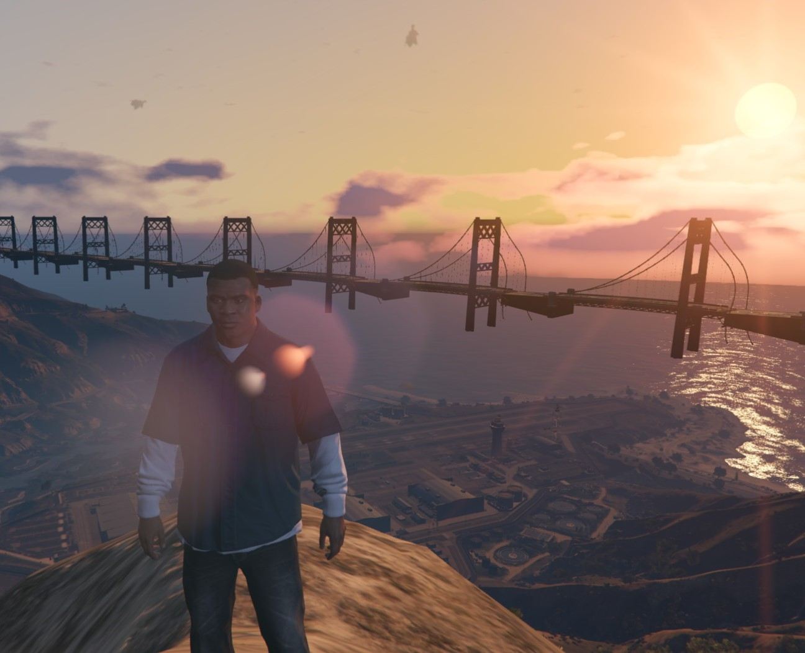

# Bridge Builder

Bridge Builder is a tool for creating bridges in a 3D environment within GTA5. This project allows for the creation of various types of bridges (topographic, flat, curved) while respecting the terrain's topography. It uses modules to load terrain data and create path points for bridge construction. The script utilizes the Stand Lua API, and GTA5's natives .

## Features

- **Topographic Bridge Creation**: Creates a bridge path respecting the terrain's topography.
- **Flat Bridge Creation**: Creates a flat bridge at a specified height above the terrain.
- **Curved Bridge Creation**: Creates a curved bridge with defined ascent and descent.
- **Construction Parameters**: Adjust various parameters such as bridge height, curve factor, and maximum flat section distance.
- **Visualization and Debugging**: Display debug lines to visualize the bridge path.

## Prerequisites

- [Git](https://git-scm.com/) installed on your machine.

## Installation

1. Clone the GitHub repository to your local machine:

    ```sh
    git clone https://github.com/Baiawai/Bridge-Builder.git
    ```

2. Navigate to the project directory:

    ```sh
    cd "C:\Users\gaelp\AppData\Roaming\Stand\Lua Scripts\Bridge Generator\Bridge Builder"
    ```

3. Initialize the Git repository (if not already done):

    ```sh
    git init
    ```

## Usage

1. Open your main menu in GTA5 and place a waypoint on the map..

2. Use the settings menu to make any presets before constructing the bridge.

3. Choose the type of bridge you want to create (topographic, flat, curved).

4. Create the bridge and have fun!

## Project Structure

- `bridge_builder.lua`: Main file containing the bridge creation logic.
- `resources/loadJson.lua`: Module for loading terrain data from JSON.
- `resources/bridge.lua`: Module containing functions for creating bridge segments.
- `resources/bridge_utils.lua`: Utilities for smoothing data and performing calculations needed for bridge construction.

## Contribution

Contributions are welcome! If you have suggestions for improvements, bug reports, or feature requests, feel free to open an issue or a pull request.

## Images



